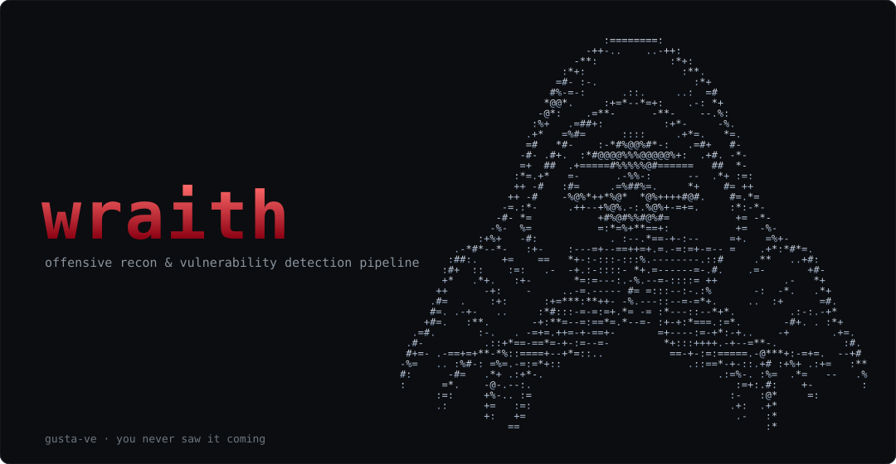
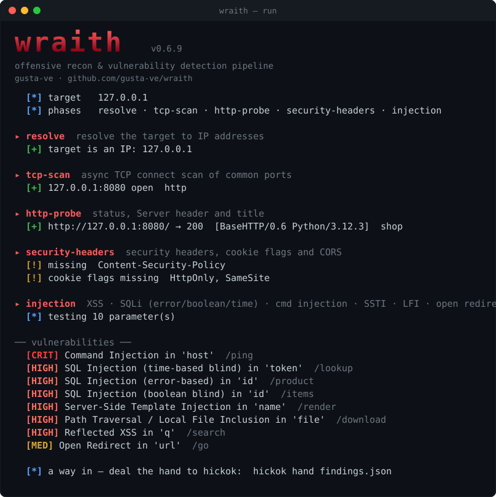

# wraith

<p align="center">
  
</p>

An offensive security scanner that runs the recon-to-detection workflow as a
pipeline of small composable phases. Point it at a target; it resolves hosts,
scans ports, maps the web surface, tests it and reports what it finds — then
hand the catch to [hickok](https://github.com/gusta-ve/hickok) to act on it. The
core has no third-party dependencies.

[](https://pypi.org/project/wraith-sec/)
[](https://github.com/gusta-ve/wraith/actions/workflows/ci.yml)
[](https://github.com/gusta-ve/wraith/releases)


- [Install](#install)
- [Usage](#usage)
- [Phases](#phases)
- [Web testing](#web-testing)
- [Post-exploitation](#post-exploitation--hickok)
- [Extending](#extending)
- [Lab](#lab)

## Install

pipx gives you a global `wraith` (the right call on Kali, which blocks system
pip via PEP 668):

```bash
sudo apt install -y pipx && pipx ensurepath
pipx install wraith-sec            # the command is `wraith`
pipx install "wraith-sec[http]"    # + httpx, faster probing
```

From a clone:

```bash
git clone https://github.com/gusta-ve/wraith && cd wraith
python3 -m venv .venv && source .venv/bin/activate
pip install -e ".[http]"
```

Or without installing anything: `PYTHONPATH=src python3 -m wraith run target`.

<details>
<summary>Restricted network (proxy / broken IPv6 / HTTP-2 hiccups)</summary>

If `pip`/`git` time out on PyPI or GitHub, grab the prebuilt wheel from the
[releases page](https://github.com/gusta-ve/wraith/releases/latest) — one file,
zero dependencies, no clone and no build step:

```bash
python3 -m venv ~/.local/share/wraith-venv
~/.local/share/wraith-venv/bin/pip install ./wraith_sec-*.whl   # the wheel you downloaded
ln -sf ~/.local/share/wraith-venv/bin/wraith ~/.local/bin/wraith
```

`git clone` failing with *"HTTP2 framing layer"*? Force HTTP/1.1:
`git config --global http.version HTTP/1.1`.
</details>

## Usage

`run` is the default command, so a target is all you need:

```bash
wraith target.com                              # full pipeline (no subcommand needed)
wraith -u https://target.com:8443              # target as a URL (-u/--url); the port is scanned too
wraith 10.10.10.5 -p resolve,tcp-scan,http-probe   # only these phases
wraith target.com -s sessions.json             # adds access-control / IDOR
wraith target.com -v                           # progress; -v 2 = attack detail (payloads/requests), -v 3 = responses
wraith target.com -x high                      # exit code 2 on a High+ finding
wraith --theme matrix target.com               # crimson (default) | matrix | ice | amber | mono
wraith showdown                                # toggle "showdown mode" — wraith plays the catch out (reveal + verdict)
wraith phases                                  # list phases and their dependencies
```

A run writes a self-contained directory:

```
wraith-runs/target.com-<ts>/
  workspace.json   every host, service, endpoint and finding (resumable)
  report.md
  report.html      dark, self-contained
  findings.json
```

A run against the bundled lab (`examples/vuln_app.py`) — every finding shown is
one wraith actually catches:



`--no-banner` and `--no-color` (or `NO_COLOR`) strip the cosmetics for logs and
CI; `WRAITH_THEME` sets a default theme.

## Phases

Each phase declares the phases it depends on. The engine resolves that graph and
runs independent phases concurrently; a failing phase is isolated and its
dependents are skipped. Everything is shared through one persisted workspace.

```
resolve            DNS resolution
tcp-scan           async TCP connect scan of common ports
http-probe         status, Server header and title
content-discovery  path/file wordlist with soft-404 filtering
tech-detect        server / language / framework / CMS fingerprint
vhost              virtual-host discovery via Host-header fuzzing
template-checks    declarative JSON/YAML checks (nuclei-style)
security-headers   security headers, cookie flags and CORS
injection          XSS, SQLi (error/boolean/time), command injection, SSTI, LFI, open redirect
access-control     Broken Access Control and IDOR (needs sessions)
```

## Web testing

`injection` crawls the target, pulls parameters from query strings and forms,
and probes each with a battery of techniques. Every technique has a single,
explainable oracle — and **every hit is confirmed a second way before it's
reported**, so a finding is evidence, not a guess:

| Technique | Oracle | Confirmed by |
|---|---|---|
| Reflected XSS | a raw `<`/`>`/`"` marker reflects unencoded | — |
| SQLi (error-based) | a single quote raises a DB error | a *balanced* quote clears it |
| SQLi (boolean-blind) | a TRUE condition page matches normal, FALSE diverges | a second, different injection context |
| SQLi (time-blind) | `SLEEP`/`pg_sleep`/`WAITFOR` delays the response | a longer sleep delays proportionally more |
| Command injection | `; sleep N` delays the response | same time-correlation proof |
| SSTI | `{{a*b}}` comes back evaluated (the product) | a second random product |
| Path traversal / LFI | `../../etc/passwd` returns a `root:x:0:0:` signature | read twice |
| Open redirect | a redirect param lands in `Location` | — |

Verbosity is levelled like other scanners. `-v` (level 1) is lightweight
progress — which parameter is being tested, crawl brackets — so a run never
looks frozen. `-v 2` is the full attack play-by-play: every payload, its oracle
measurement (similarity ratios, response timings) and the confirmation step,
plus each HTTP request. `-v 3` adds the responses:

```bash
wraith target.com -p injection -v      # level 1 — progress only
wraith target.com -p injection -v 2    # the detailed attack trace
```

`security-headers` reports missing CSP/HSTS/X-Frame-Options/nosniff, weak cookie
flags and CORS that reflects an arbitrary origin.

`access-control` needs authenticated sessions. It crawls as the privileged
session and replays every request as the lower-privilege and anonymous ones; a
lower principal getting identical content is a vertical bypass, and mutating
numeric ids surfaces IDOR. Grab a session with:

```bash
wraith login http://target/login -u alice -p secret \
    --user-field user --pass-field password -o sessions.json
```

## Post-exploitation — [hickok](https://github.com/gusta-ve/hickok)

wraith finds and proves the way in; landing a shell and working the box is
[**hickok**](https://github.com/gusta-ve/hickok)'s job — wraith's companion. It
reads a wraith run and acts on it:

```bash
hickok hand wraith-runs/<run>/findings.json   # flags the code-exec footholds
hickok -l 9001                                # catch the reverse shell
```

wraith holds the aces, hickok brings the eights — aces and eights, the dead
man's hand.

## Extending

A phase is one file; a check can be pure data. See
[docs/writing-a-phase.md](docs/writing-a-phase.md) and
[docs/writing-a-template.md](docs/writing-a-template.md).

```python
from wraith.core.phase import Phase, register

@register
class MyPhase(Phase):
    name = "my-phase"
    requires = frozenset({"http-probe"})

    async def run(self, ws, console):
        for ep in ws.endpoints:
            ...  # ws.add_finding(...)
```

## Lab

`examples/vuln_app.py` is a deliberately vulnerable app to practise against and
to exercise every web phase: BAC, IDOR, reflected XSS, SQLi (error/boolean/time),
command injection, SSTI, path traversal/LFI, open redirect, CORS, insecure
cookies and missing headers.

```bash
python3 examples/vuln_app.py &
wraith 127.0.0.1 -s examples/sessions.json -v
```

## Tests

```bash
pip install -e ".[dev]" && pytest
```

## Disclaimer

Built for security research and testing — point it where you're meant to. What
anyone does with it from there is theirs alone; the author takes no
responsibility for misuse or for any damage caused.

## License

MIT.

---

*You never saw it coming — the wraith was already holding aces.*
